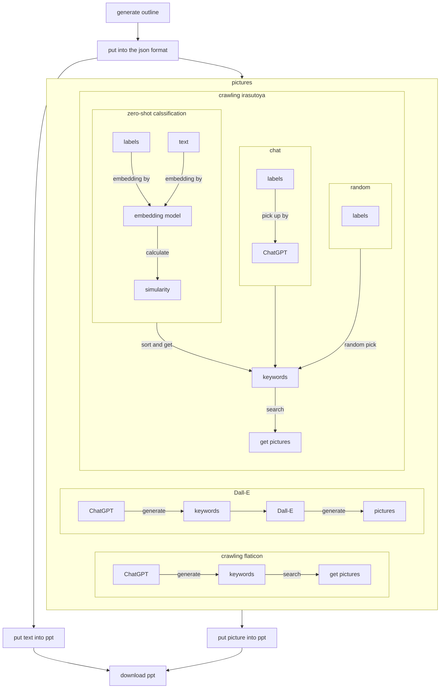

# slides_generator
Generate infographs for instagram with ChatGPT for text and multi-source for pictures

You just need to type in your topic, upload your powerpoint template, and choose the source of pictures, then you can generate your infographs for instagram.

## User Control

1. you need to get OpenAI API KEY, and put it into `openai.api_key`
2. think up a powerpoint filename for later download. `ppt_filename`
3. choose a topic that you want to share `topic`
4. choose a language you want to use `language`
5. how many pages you want to use. WARNING, this code I only generate the content of a series of infographs. The cover or some special page please add them manually. `number_pages`
6. `prs= Presentaion("content/new_template.pptx")` please change `"/content/new_template.pptx"` into the template powerpoint path. you can put your special page first, I put all generated paged after those page.
7. choose picture source you want. There are three source you can choose:
    - `dalle` Dall-E, picture generator from OpenAI
    - `flaticon` pictures from [flaticon](https://www.flaticon.com/)
    - `irasutoya` pictures from [irasutoya](https://www.irasutoya.com/), the biggest free picture database in Japan.
8. If using `irasutoya`, you need to choose the method you want to pick up the pictures
    - `classification` get the embedding of text with *text-embedding-ada-002* in OpenAI, and do zero-shot classification to choose the most relevant keywords according to the content
    - `chat` pick up the most relevant keywords according to the content with using ChatGPT 
    - `random` just random pick three keywords
9. `money` is to calculate how much you pay when you call the API from OpenAI

There are more input hide in the function, you can find out by yourself.

## Process

## Detail function
`irasudoya_pics(slide, money, get_keywords_methods:str="classification", number_keywords:int=3, temperature:float=0)`
- number_keywords: the number of keywords you pick, usually 2 is enough
- temperature: the temperature of ChatGPT, usually near 0 is better. This will be ignoreif you choose **random** or **classification**.
- When this function cannot find a result, it will randomly pick up a picture for you

`dalle_pics(slide, money, number_keywords:int=3, temperature:float = 0.9, size_picture:int=256, prompt:str=None)`
- number_keywords: the number of keywords you pick
- temperature: the temperature of ChatGPT
- size_picture: only support 256x256, 512x512, and 1024x1024. Different size has different price. The detailed can see OpenAI API Pricing.
- prompt: the default prompt is "{keys};svg colored icon with blank background". If you want to use your prompt, please keep "{{keywords}}" in your prompt.

`flaticon_pics(slide, money, number_keywords:int=3, temperature:float=0.9, size_picture:int=256)`
- number_keywords: the number of keywords you pick, usually 3 is enough
- temperature: the temperature of ChatGPT
- size_picture: only support 128x128, 256x256, and 512x512.

## Results
- [Results](https://imgur.com/QczmwKb)
- The partial template is in `new_template.pptx`
